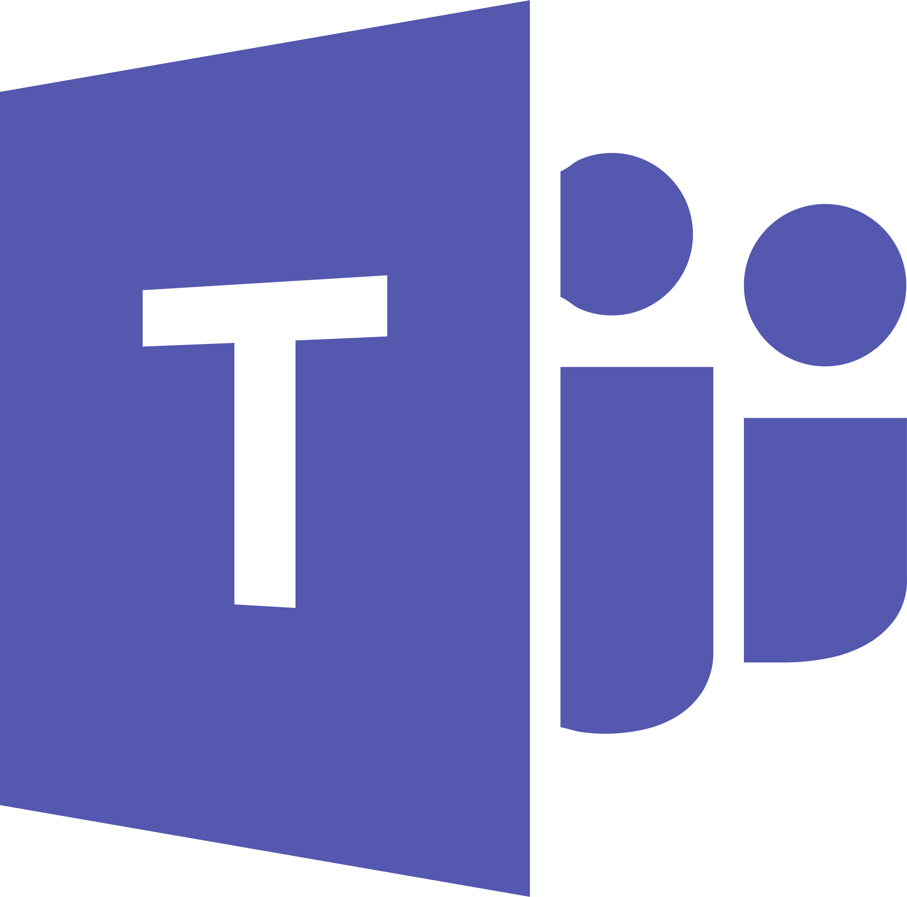
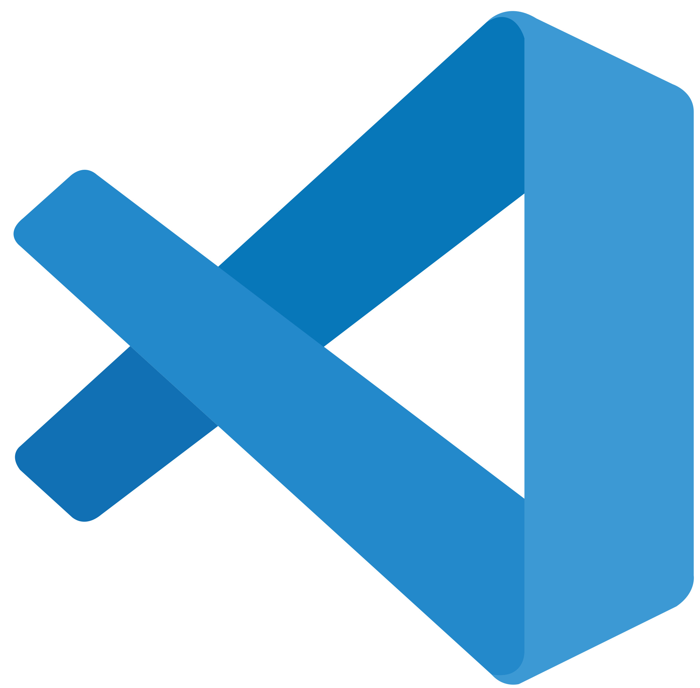

# Ferramentas Utilizadas

## Introdução

Este documento descreve as ferramentas adotadas no desenvolvimento deste trabalho, abrangendo aquelas já implementadas, em uso atual ou previstas para uso futuro. Cada ferramenta desempenha um papel crucial na execução e apresentação das tarefas realizadas pela equipe.

A escolha adequada de ferramentas é essencial para o sucesso de projetos de software. Segundo Flores (2022), ferramentas como Microsoft Project, Planner e JIRA são fundamentais para auxiliar gestores na distribuição, priorização e monitoramento de tarefas, visando à eficiência e eficácia do projeto. Além disso, Giocondo et al. (2021) destacam que o uso de ferramentas de gestão de projetos, como SCRUM, Kanban, Microsoft Excel, Design Thinking, Azure DevOps e MS Project, contribui significativamente para a organização e acompanhamento das etapas do desenvolvimento de software.

As ferramentas estão apresentadas na Tabela 1, acompanhadas de seus logotipos e descrições.

  
    
<b>Tabela 1:</b> Ferramentas Utilizadas

  

<table>
  <thead>
    <tr>
      <th style="text-align: center;">Logo</th>
      <th style="text-align: center;">Descrição</th>
    </tr>
  </thead>
  <tbody>
    <tr>
      <td style="text-align: center;">
        
      </td>
      <td><strong>Google Docs</strong>: Uma ferramenta poderosa para criação, edição e colaboração em documentos em tempo real. Ideal para elaboração de relatórios, propostas e outros documentos relacionados ao projeto, com suporte para trabalho em equipe e acesso de qualquer lugar.</td>
    </tr>
    <tr>
      <td style="text-align: center;">
        
      </td>
      <td><strong>Google Chrome</strong>: O navegador da web mais popular, utilizado para testar a funcionalidade dos sites, navegar por ferramentas e acessar recursos do projeto de forma rápida e eficiente. Conhecido pela sua velocidade, segurança e compatibilidade com diversas tecnologias.</td>
    </tr>
    <tr>
      <td style="text-align: center;">
        
      </td>
      <td><strong>Git</strong>: Sistema de controle de versão essencial para gerenciar alterações no código-fonte, permitindo a colaboração entre os membros da equipe. Com Git, é possível manter um histórico completo de modificações e resolver conflitos de código de forma organizada e eficiente.</td>
    </tr>
    <tr>
      <td style="text-align: center;">
        
      </td>
      <td><strong>GitHub</strong>: Plataforma de hospedagem de código-fonte que permite a colaboração em projetos de desenvolvimento de software. Oferece ferramentas para controle de versões, integração contínua e uma interface para visualização e revisão de código, facilitando a colaboração em equipe.</td>
    </tr>
    <tr>
      <td style="text-align: center;">
        
      </td>
      <td><strong>Microsoft Teams</strong>: Plataforma de comunicação e colaboração em equipe, que integra chat, videoconferências, compartilhamento de arquivos e outras ferramentas. Ideal para reuniões virtuais, gerenciamento de tarefas e discussão de ideias em tempo real.</td>
    </tr>
    <tr>
      <td style="text-align: center;">
        
      </td>
      <td><strong>Telegram</strong>: Aplicativo de mensagens instantâneas usado como principal canal de comunicação da equipe. Permite troca rápida de mensagens, envio de arquivos e criação de grupos de discussão, ideal para manter todos atualizados e facilitar a interação contínua entre os membros.</td>
    </tr>
    <tr>
      <td style="text-align: center;">
        
      </td>
      <td><strong>Visual Studio Code</strong>: Editor de código-fonte altamente configurável e leve, utilizado para desenvolvimento de software. Suporta várias linguagens de programação e oferece extensões que facilitam a integração com outras ferramentas e plataformas, como o GitHub, sendo essencial para o desenvolvimento do projeto.</td>
    </tr>
  </tbody>
</table>

  
<b>Fonte:</b> João Pedro Costa, 2025

## Referências

> FLORES, Lucas da Silva. *Ferramentas de Gestão de Projetos de Desenvolvimento de Software: um mapeamento sistemático da literatura*. 2022. Disponível em: [https://lume.ufrgs.br/handle/10183/245266](https://lume.ufrgs.br/handle/10183/245266). Acesso em: 11 abr. 2025.

> GIOCODO, Francisco Ignácio Giocondo; MARTINS JUNIOR, Antônio Sergio; MAKIYA, Ieda Kanashiro. *Ferramentas de Gestão de Projetos para o Desenvolvimento de Softwares: Uma Pesquisa Survey*. 2021. Disponível em: [https://recima21.com.br/index.php/recima21/article/view/5064](https://recima21.com.br/index.php/recima21/article/view/5064). Acesso em: 11 abr. 2025.